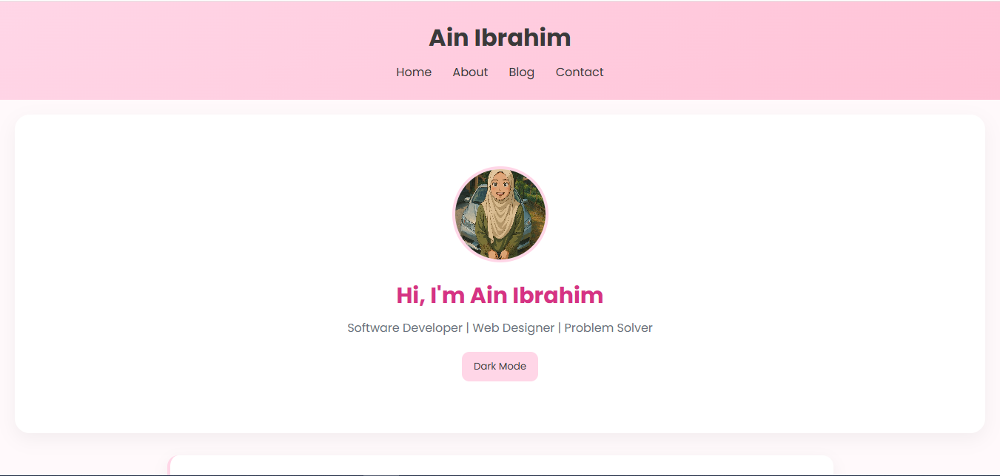
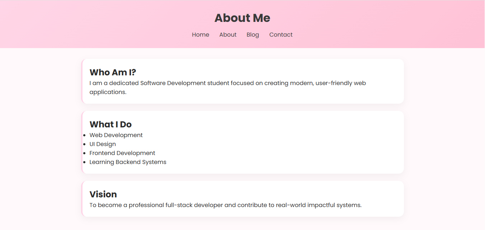
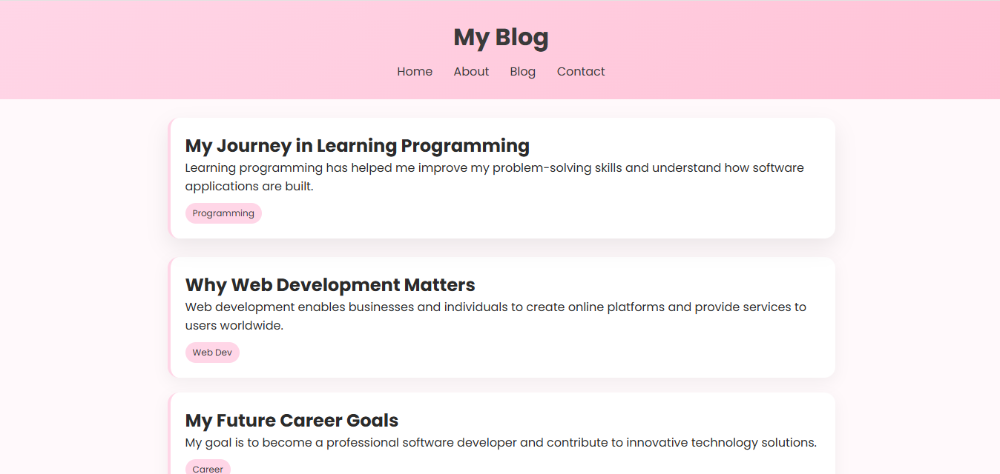
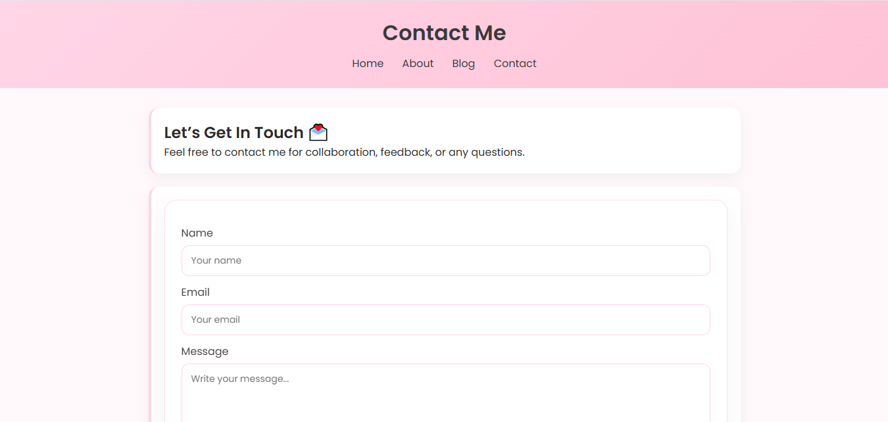

# Personal Blog Portfolio

## Description

This project is a Personal Blog Portfolio developed for the CSD34203 Special Topics in Software Development course.

It is a simple responsive website that includes multiple pages such as Home, About, Blog, and Contact. The website allows users to navigate through different sections, view blog posts, and interact with a contact form. It also includes a dark mode feature for better user experience.

---

## Features

* Home Page (Landing page with introduction)
* About Page (Personal information about the author)
* Blog Page (Contains 2–3 sample blog posts)
* Contact Page (Simple contact form)
* Responsive design for mobile and desktop
* Dark mode toggle feature
* Navigation between multiple pages

---

## Technologies Used

* HTML5
* CSS3
* JavaScript

---

## Project Structure
index.html
about.html
blog.html
contact.html
style.css
script.js
images/

---

## Screenshots

### Home Page

### About Page

### Blog Page

### Contact Page

---

## How to Run the Project

1. Clone or download this repository
2. Open the project folder in your computer
3. Open `index.html` using any web browser
4. Navigate through the website using the menu links

---

## GitHub Usage

* Repository created on GitHub
* Minimum 3 meaningful commits made
* Organized folder structure
* README.md updated with full documentation

Example commits:
- Added homepage layout
- Created blog and about pages
- Styled website with CSS and added dark mode feature

---

## Optional Feature

Dark Mode is implemented using JavaScript for better user experience in low-light environments.

---

## Author

Ain Ibrahim

---

## Course

CSD34203 Special Topics in Software Development